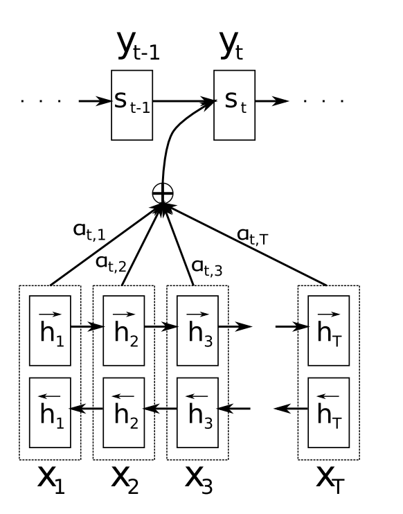

Translation
====

**Translate English to Chinese with seq2seq  + attention model.**

Training
----

1. `Put corpus(en-zh.txt) under data directory.`
`Sentences are splited by "\t", for examples:`

	`do you think we look young enough to blend in at a high school ?	你们 觉得 我们 看起来 够 年轻 溜进 高中 吗 ？`
	
	`hi , honey . i guess you 're really tied up in meetings .	嗨 ， 亲爱 的 。 你 现在 肯定 忙 着 开会 呢 。`
	
	`because you want to start a family before you hit the nursing home .	因为 你 想 在 进 养老院 前 娶妻生子 。`
	
	`she 's got to have me in her sight like 24 hours a day .	我 就 一天 24 小时 都 得 在 她 眼皮子 底下 。`
	
	`find a safety chain or something to keep these lights in place .	找条 牢靠 的 链子 或者 别的 什么 固定 住 这些 灯 。`
	
	`so that no parent has to go through what i 've known .	为了 不让 别的 父母 经历 我 的 遭遇 。`

2. `python train.py`

Evaluation
----
`python eval.py`

Translate
----
`python translate.py "english sentence"`

Requirements
----

- Python 3.6
- Pytorch 0.4.0
- torchtext 0.3.0

Reference
----

[Neural Machine Translation by Jointly Learning to Align and Translate](https://arxiv.org/abs/1409.0473)
